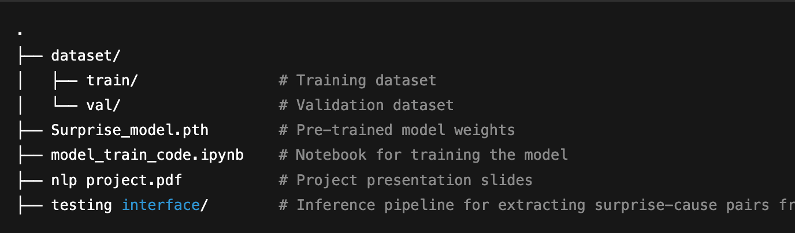

# Surprise Emotion-Cause Pair Detection from Videos

This project presents a deep learning pipeline capable of detecting **surprise emotion** and its corresponding **cause** throughout the timeline of a specific uploaded video. The system leverages multimodal inputs to perform temporal localization and cause identification.

---

## 📁 Project Structure

---

## 🚀 Features

- **Emotion Detection**: Focused on detecting **surprise** emotion within videos.
- **Cause Extraction**: Automatically extracts **causal events** linked to surprise emotions.
- **Temporal Tracking**: Localizes both emotion and cause over the video timeline.
- **End-to-End Pipeline**: From video upload to final prediction — all handled in one interface.

## 🧠 Model Training

To retrain the model:

1. Navigate to `model_train_code.ipynb`
2. Ensure the `dataset/` directory is correctly structured
3. Extract the final_train.zip and final_val.zip in the dataset folder
4. Set the train_dataset = MultimodalEmotionDataset('/dataset/final_train')
5. Set the val_dataset = MultimodalEmotionDataset('/dataset/final_val')
6. Run all cells to train the model and save weights

---

## 🔍 Inference & Testing

To test the pipeline on your own video:

1. Place the input video in the appropriate directory (as per the testing interface's setup)
2. Navigate to `testing_interface/`
3. Run the main script to extract:
   - Surprise segments
   - Corresponding causal phrases or clips

---

## 📊 Presentation

Refer to `nlp project.pdf` for a comprehensive overview of the model architecture, dataset details, experimental results, and analysis.

---
