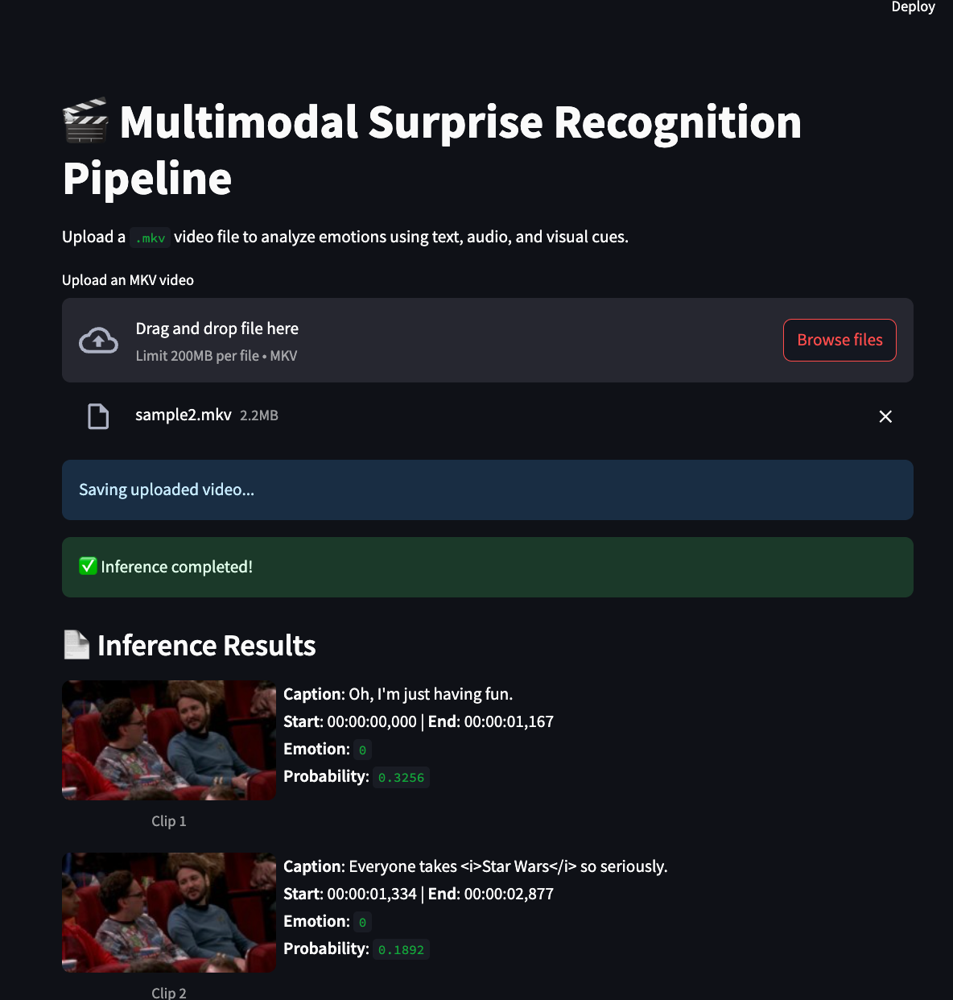

# 🎥 Surprise-Cause Detection Pipeline

This repository provides tools to extract and display **surprise-cause pairs** from a video using a combination of subtitle alignment, mid-frame analysis, and inference models.

It includes:

- A full-featured Jupyter Notebook for pipeline execution
- A Streamlit app for running the process via an interactive UI

---

## 📁 Files Overview

| File                                  | Description                                                                |
| ------------------------------------- | -------------------------------------------------------------------------- |
| `final_pipeline_inference_code.ipynb` | Jupyter notebook containing the full pipeline for surprise-cause detection |
| `streamLit_app.py`                    | Streamlit app for interacting with the pipeline via a web interface        |
| `sample2.mkv`                         | Sample video file used for testing                                         |
| `sample2.srt`                         | Subtitle file for `sample2.mkv`. Generated if not present                  |
| `readme.md`                           | This README file                                                           |

---

## Install all the required libraries

```bash
pip install -r requirements.txt
```

## 🚀 Running the Streamlit App

1. Ensure that the following files are in the **same directory**:

   - `streamLit_app.py`
   - A test `.mkv` video file (e.g., `sample2.mkv`)
   - The corresponding `.srt` subtitle file (e.g., `sample2.srt`)

2. model = load_trained_model('/Users/akhsinak/co/nlp_project/models/best_model_hubert.pth', device)

- change this line according to where you load the model

3. Run the app:

   ```bash
   streamlit run streamLit_app.py
   ```

4. If the .srt file is not present, the app will:

- Use Google Speech-to-Text to generate subtitles
- Segment the video using the transcript

5. Streamlit app only produces a jSON which has all the surprise Yes or not markings in the file, this JSON file has to be passed to 2nd part of the pipeline ( 2nd part of pipeline is in the full_pipeline python notebook) for the Cause Extraction

6. If all the pipeline has to be run in one go then please use the `final_pipeline_inference_code.ipynb`



## 🚀 Running the `final_pipeline_inference_code.ipynb`

-----------------------------------------------------------------------<br>
model = load_trained_model('../Surprise_model.pth', device)<br>
-----------------------------------------------------------------------<br>

- Change this line to wherever you load the model
- in the .env file set the BEARER_TOKEN="Your API key" from OLA Krutrim

-----------------------------------------------------------------------<br>
video_input_path = "testvideo.mkv" # <-- change this<br>
-----------------------------------------------------------------------<br>

- Change this to whatever video you want (has to be in same folder as .ipynb)

## 🧠 What the Pipeline Does

1. Loads the video and subtitle file (or transcribes it)
2. Segments the video based on subtitle timestamps
3. Extracts mid-frames from each segment
4. Infers surprise and cause using the trained models
5. Displays results in an interpretable format
